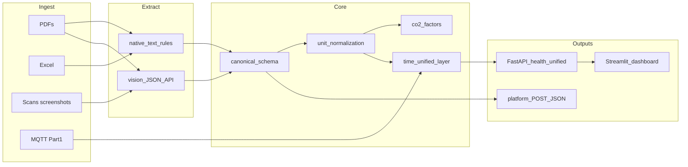

# Eco-Edge — Part 2 master plan (onboarding doc)

**Purpose:** Single reference for a new conversation: rubric-aligned pipeline, dashboard, document specifics (STEG / SONEDE / gas / SCADA), Part 1 merge story, and ground-truth vs demo clarity.  
**Sources merged:** Cursor plans `part_2_pipeline_plan_a6cc1e0e` + `part_2_plan_delta_images_e444c88f`, plus team Q&A.  
**Location:** This file lives in [`part2/`](README.md) with Part 2 specs and sample data context.  
**Authoritative challenge text:** [cahier_de_charge.md](../cahier_de_charge.md). Repo strategy cross-links: [plan.md](../plan.md), [example_images_data_factures_et_diverses.md](example_images_data_factures_et_diverses.md).

---

## 0) What Part 2 is (one paragraph)

Build a **reproducible** path from **heterogeneous energy documents** (PDF, Excel, scans) to **canonical kWh + traceable conversions + CO₂**, optionally **short-term forecast** and **anomalies**, merged with **Part 1 MQTT telemetry** on a **shared timeline** for a **working dashboard** and **Dockerized API**. Submit JSON to the platform where applicable; judges can test live.

---

## 1) Ground truth vs example docs vs dashboard (critical)

| Artifact | What it is | How you use it |
|----------|------------|----------------|
| **Official test dataset + annotation file** | From organizers (cahier: distributed at Day 2 00:00). Hidden or partial feedback via **platform F1** on extraction / CO₂ / anomalies. | **Tune and score** your pipeline; `pytest` + POST scripts; compare predictions to reference. |
| [example_images_data_factures_et_diverses.md](example_images_data_factures_et_diverses.md) | Shapes and challenges (STEG 4 slots, gas NM³/TH/PCS, SONEDE m³, SCADA context). | **Parser design**, prompts, validators—not a substitute for organizer labels. |
| **Detailed image spec** (e.g. `detailed_description_of_images.md` in Cursor plans) | Concrete numbers / tables for sample bills (Sept 2025 STEG, May 2024 gas, Feb 2023 SONEDE, SCADA strings). | **Fixtures and CI** (`part2/fixtures/*.json` once added); schema and UI targets. Still not official GT unless the same file is on the test bundle. |
| **Dashboard (demo)** | What operators see. | Must reflect **pipeline output on raw inputs** + live IoT. Optional **debug** view: side-by-side with GT during dev only. **Do not** ship a UI that only displays pre-loaded GT as if it were extraction—that skips the scored path. |

---

## 2) How STEG / SONEDE / gas connect to Part 1 IoT (intuition)

- **Not a physical link:** the ESP32 does not read the STEG meter. **Connection = architecture + time + UI.**
- **Documents:** slow, fat, official—**billing periods**, **kWh / TH / m³**, **TND**, site-level story (tri-gen injection vs production, gas Scope 1, water cost split).
- **Part 1 ([sketch.ino](../sketch.ino), [README.md](../README.md)):** fast stream—`timestamp`, accel/gyro/temp, demo `current_amps`, `edge_anomaly`, buffer/reconnect story.
- **Merge in software:** assign bills **`period_start` / `period_end`**. **Downsample** IoT inside that window (mean/max temp, mean ‖accel‖, **anomaly rate**, gap stats). Expose **`GET /unified`** with document KPIs + IoT aggregates + **recent live strip**.
- **Pitch-safe framing:** joint view enables **investigation** when bills or kWh move (“show me edge behavior in the same month”). Avoid claiming **causality** from MPU alone; optional hints: “high anomaly rate overlapping bill period” as **early warning**, not root-cause proof.

---

## 3) Scoring map (optimize in this order)

From [cahier_de_charge.md](../cahier_de_charge.md) Part 2:

| Priority | Criterion | Pts | Stance |
|----------|-----------|-----|--------|
| 1 | Document extraction accuracy | **40** | Hybrid extractors + eval harness; iterate on platform F1 |
| 2 | Unit normalization accuracy | **25** | `ConversionEngine` + versioned YAML; bill overrides |
| 3 | Dockerized pipeline + API docs | **20** | Cold `docker compose up`, OpenAPI `/docs` |
| 4 | Dashboard quality | **20** | KPIs, provenance, validation warnings, **live MQTT** |
| 5 | CO₂ estimation quality | **15** | Config factors + `method_note`; align with organizer reference |
| + | Bonus anomaly | **+15** | IoT rules + optional document / SCADA if GT fits |
| + | Bonus innovation | **+25** | After core: tri-gen viz, trace export, sensitivity sliders |

**~90% core target:** aim for **108/120** on extraction + norm + CO₂ + dashboard + Docker; bonuses opportunistic. **Extraction** quality is proven only by **official set + platform**, not narrative docs alone.

---

## 4) Philosophy ([grill-me.md](../grill-me.md)) — decisions locked in plan

- **Reproducible batch**, no manual production edits, **versioned prompts/models**, **JSONL audit** per file (parser path, raw fields, normalized values, factors).
- **Open branch until dataset lands:** if both **TH** and **NM³ + PCS** appear, default **authoritative energy = bill TH line**; NM³ cross-check within tolerance—document in `part2/pipeline/config/conversions.yaml` when implemented (see [plan.md](../plan.md) §9).

---

## 5) Architecture

Align with [plan.md](../plan.md) §5–9. **Prefer implementing under `part2/`** so Part 2 stays isolated: e.g. **`part2/pipeline/`**, **`part2/dashboard/`**, **`part2/docker-compose.yml`** (mirror the layout described at repo root in plan.md, or document a single chosen layout in the main [README.md](../README.md)).

---

## 6) Document extraction (40 pts) — hybrid

**Why hybrid:** F1 rewards correct numbers; table OCR alone is brittle on merged cells; raw LLM output hallucinates without **images + strict JSON schema + validators**.

**Router (try in order):**

1. **Excel/CSV:** `openpyxl` / `pandas`.
2. **Text-layer PDF:** `pymupdf` / `pdfplumber` + layout rules for STEG slots, CTR indices, SONEDE lines, gas TH/NM³/PCS.
3. **Scans / image PDFs / SCADA screenshots:** **Gemini Flash** (or equivalent) — page or tile image + frozen prompt → JSON only; **`prompt_version`** in repo; retries; **cache by file hash + prompt version**; **`--offline`** replay JSONL for venue demos.

**Hardware note:** GTX 1650 local OCR possible but **time-to-accuracy** favors cloud multimodal for messy French/Tunisian layouts; mitigate with **cached** responses and deterministic path when PDF has text.

**Tactics:** per-field validation (index monotonicity, unit whitelist, TH vs NM³×PCS tolerance); **second-pass** crop on failure; dev-only Streamlit inspector; submission path **fully automatic**.

---

## 7) Schema delta — STEG electricity (from detailed image spec)

Do **not** model only generic “achat/vente.” Sample bills include **distinct meter roles**:

| Example CTR | French heading sense | Canonical `meter_role` |
|-------------|----------------------|-------------------------|
| 3738358 | Énergie **injectée** (principal) | `grid_injection` (sold to grid) |
| 61971444 | Énergie **produite** (interne) | `onsite_generation` (tri-gen) |

Per meter: slots **`Jour`, `Pointe`, `Nuit`, `Soire`**, tariff codes (e.g. `2.8.3`, `6.8.3`), **Ancien / Nouveau**, active **delta kWh**.

**Réactive row (e.g. on produced-energy meter):** store **`reactive_*`** as its **own unit/channel** (likely kVArh or bill-specific)—**never** add reactive into active **kWh** or primary **CO₂** totals.

**Derived KPIs (dashboard + README):**

- **Net injection profile** (TOU for injected energy).
- **Self-consumed electricity (narrative):** e.g. relate **onsite produced (active)** vs **injected**; define formula and signs once.
- **Avoided / credited grid CO₂** for injection: `injected_kwh × grid_intensity_tn` (config key, documented assumption), separate from Scope 2 consumption logic.

Vision/rules should key on headings: *Injectée*, *Produite*, *Achat*, *Vente* as dataset varies.

---

## 8) Natural gas (STEG) — fixtures from detailed spec

Use as **CI regression** (order-of-magnitude and parsing), not as organizer GT:

- NM³ delta **204,884**; **PCS 10.079**; **TH 1,782,471**; TH→kWh **×1.163** → ~**2,072,913 kWh**.
- Costs: **HT** lines vs **NET à payer TTC**.
- Optional sanity: gas **~0.202 kg CO₂e/kWh** → **~418 t** that month—**plausibility check** until official factors supplied.
- **Validators:** Ancien/Nouveau direction per meter; detect **swapped** columns; TH vs NM³×PCS within tolerance.

---

## 9) SONEDE water

Extract **m³** plus **Frais consommation eau (HT)**, **Frais assainissement (HT)**, **NET à payer (TTC)**. Dashboard: **cost split** (pie from extracted values, not hardcoded 54/46). Water stays **parallel KPI**—no silent merge into “energy kWh” without a defended model ([plan.md](../plan.md)).

---

## 10) SCADA / HMI (optional extraction + anomaly)

Normalize to records: `timestamp`, `severity` (`critical` | `warning` | `info`), `code`, `subsystem` (Chiller, engine, network). UI: severity colors; consider **two regions** (scroll list + pending bottom strip)—vision may need **two crops** or layout clustering.

---

## 11) Unit normalization (25 pts)

- **Canonical:** **kWh** for thermal/electrical energy lines (cahier + [plan.md](../plan.md)).
- **`part2/pipeline/config/conversions.yaml`** (when created): MWh, GJ, Gcal, BTU, toe, TH, NM³ (via PCS where needed).
- **Every normalized row:** `value_kwh`, `source_unit`, `factor_used`, `factor_source` (`bill` vs `default`).
- **Gas:** **TH authoritative** when printed; default **1.163 kWh/TH** unless bill states otherwise.
- **Electricity:** per-slot kWh; preserve roles for CO₂ sign / grid narrative.

---

## 12) CO₂ (15 pts) + forecast

- **`part2/pipeline/config/co2_factors.yaml`** (when created): separate factors for **grid**, **natural gas**, optional **avoided grid** for exports.
- Outputs: `co2_kg` per line + rollups; **`method_note`** always.
- **Forecast:** naive / seasonal naive / linear trend; upgrade to Prophet only if GT rewards it—organizers note simple methods can score well.

---

## 13) Merge layer + MQTT

- Subscriber or worker: persist Part 1 JSON to **SQLite** or **Parquet** (`timestamp`, `sensors`, `edge_anomaly`).
- **Unified view:** bill periods + **aggregated** IoT per period + **live** last-N window.
- **[rapport_audit.md](../rapport_audit.md):** use for **labeled scenarios** / pitch numbers, not as fake extracted fields.

---

## 14) Dashboard (20 pts)

- **Streamlit** under `part2/dashboard/`; calls **`GET /unified`**, `/health`; link **OpenAPI**.
- Panels: ingestion/parser path, validation warnings, energy/CO₂/cost KPIs, tri-gen story where data exists, **live MQTT strip**, optional anomalies.
- **Demo line:** device → broker → pipeline → dashboard (Wokwi + HiveMQ or Mosquitto in compose).

---

## 15) Docker + API (20 pts)

- **`docker compose up --build`** from `part2/` (or documented root path); **`.env.example`** (e.g. `GOOGLE_API_KEY`, `DATASET_ROOT`).
- Services: optional **Mosquitto**, **pipeline** (FastAPI), **dashboard**; volume for dataset.
- Endpoints (minimum): `GET /health`, `POST /ingest`, `GET /documents`, `GET /unified`, `GET /metrics`; **`/docs`** OpenAPI.

---

## 16) Bonus anomaly (+15)

- **IoT:** stuck sensor, spike (z-score), dropout (gaps), drift (CUSUM / rolling mean)—`{type, timestamp, sensor, confidence}`.
- **Documents:** MoM %Δ if GT supports; avoid noisy flags.
- **SCADA:** only if extractors stable.

---

## 17) Bonus innovation (+25)

After core: e.g. **4-slot / injection waterfill**, traceability CSV export, **PCS sensitivity** what-if, cost-on-the-table slide tied to audit **with assumptions stated**.

---

## 18) Work split ([plan.md](../plan.md) §14)

| Owner | Focus |
|-------|--------|
| Pipeline | Extractors, YAML, Docker, platform JSON, tests |
| UI | Streamlit, compose, demo script |
| Edge glue | MQTT persistence, anomaly rules, forecast baseline |

**Daily ~30 min:** broker host, schema version, one full ingest run.

---

## 19) Risks and mitigations

| Risk | Mitigation |
|------|------------|
| API / Wi-Fi down at venue | JSONL cache, `--offline`, last good run |
| LLM drift | Pinned prompt version, schema validation, numeric guards |
| TH vs NM³ precedence | YAML + cross-check validator |
| Time crunch | Breadth across PDF/Excel/image over one “perfect” family unless platform is per-type weighted |

---

## 20) Definition of done (checklist)

- [ ] Official `DATASET_ROOT` → one command batch → **platform POST** with logged scores  
- [ ] STEG **electricity + gas + SONEDE** shapes handled (examples + delta schema)  
- [ ] Every kWh row has **factor provenance**  
- [ ] `docker compose up` + `/health` + `/docs` + README Part 2 repro  
- [ ] Dashboard: **unified KPIs + live IoT**  
- [ ] Optional: anomaly JSON matches bonus spec if chasing +15  

---

## 21) Consolidated implementation todos

_From original pipeline plan + image delta plan (single list)._

**Scaffold:** `part2/pipeline/`, `part2/dashboard/`, `part2/docker-compose.yml`, `part2/.env.example`; FastAPI `/health`, `/docs`, `/unified` stub.

**Schema:** Pydantic + JSONL audit; **`meter_role`**; active per-slot kWh; **reactive** separate fields; line items with `parser_path`, confidence, raw vs normalized.

**Extractors:** Excel + text PDF for STEG (roles + 4 slots + CTR), gas TH/NM³/PCS, SONEDE m³ + HT/TTC lines; validators (indices, TH vs NM³×PCS).

**Vision:** Gemini Flash, strict JSON, retries, hash cache, `prompt_version`; tile second pass on validation fail.

**Conversions:** `conversions.yaml` + `ConversionEngine`; gas TH default 1.163; bill overrides.

**CO₂ + forecast:** `co2_factors.yaml`; minimal series forecast; MQTT store; merge for `/unified`.

**Dashboard:** Streamlit KPIs, provenance, charts, validation panel, MQTT reader, OpenAPI link; README formulas for self-consumption / avoided CO₂.

**Eval:** pytest fixtures from example MD + **detailed spec** (STEG Sept 2025 two CTRs, gas May 2024, SONEDE Feb 2023); on GT drop, POST + F1 logging.

**Anomaly / SCADA:** IoT rules; SCADA normalized severity/code; optional dual-crop.

**Docs:** README Part 2 section in repo root (compose, `DATASET_ROOT`, API, demo order, **LLM accountability** per cahier).

**Hygiene:** Copy or summarize `detailed_description_of_images.md` into **`part2/fixtures/`** or **`part2/docs/`** so CI does not depend on `.cursor/plans/`.

---

## 22) Key repo files

| File | Role |
|------|------|
| [cahier_de_charge.md](../cahier_de_charge.md) | Official rubric and deliverables |
| [plan.md](../plan.md) | Monorepo layout, MQTT JSON, Part 2–3 split |
| [example_images_data_factures_et_diverses.md](example_images_data_factures_et_diverses.md) | Document family overview (this folder) |
| [sketch.ino](../sketch.ino), [README.md](../README.md) | Part 1 telemetry contract |
| [rapport_audit.md](../rapport_audit.md) | Factory context for pitch / scenarios |

---

*End of `plan_part2.md`. When starting a new chat, attach this file plus `cahier_de_charge.md` and any official dataset notes.*
